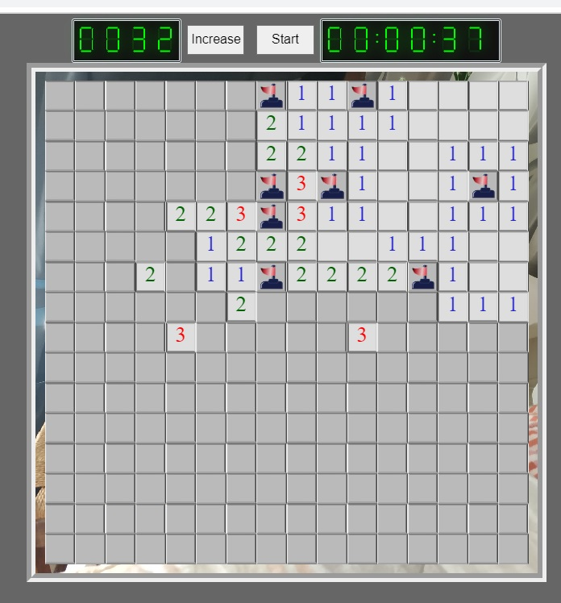

# Buscaminas

Buscaminas with JavaScript



Also includes functionalities as 
- double clicking a water tile when the surrounding flags match the neighbour mines numer of a water tile will unfold all surrounding tiles.
- Failed bombs, Deactivated bombs, Hitted and Hidden show with different
- 1000 x 1000 board
  

 # Compile the code
 

To compile confeti animation

```
elm make elm/src/Main.elm --output --optimize build/confeti.js
``` 

to uglify both confeti.js an and buscaminas.mjs

```
uglifyjs build/confeti.js --compress "pure_funcs=[F2,F3,F4,F5,F6,F7,F8,F9,A2,A3,A4,A5,A6,A7,A8,A9],pure_getters,keep_fargs=false,unsafe_comps,unsafe" | uglifyjs --mangle --output build/confeti.min.js
uglifyjs src/buscaminas.mjs --compress "pure_funcs=[F2,F3,F4,F5,F6,F7,F8,F9,A2,A3,A4,A5,A6,A7,A8,A9],pure_getters,keep_fargs=false,unsafe_comps,unsafe" | uglifyjs --mangle --output build/buscaminas.min.js
``` 

If uglify is not available
```
npm install uglify-js --global
```

# Open web on dev with visual studio
Live server over src/buscaminas.html
    

# References

Información about tetris, rules and mechanics

https://es.wikipedia.org/wiki/Buscaminas

Guide of elm

https://guide.elm-lang.org/install/elm.html

https://package.elm-lang.org/packages/BrianHicks/elm-particle/latest/

https://elmprogramming.com/subscriptions.html

More about optimizing build 

https://github.com/elm/compiler/blob/master/hints/optimize.md
